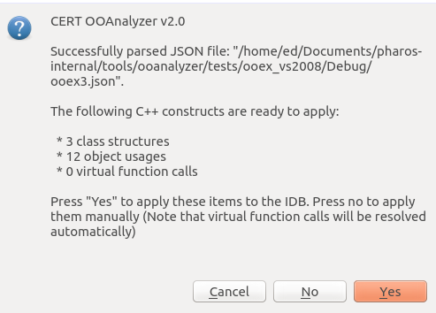

# OOAnalyzer Plugin for IDA Pro

The OOAnalyzer IDA Pro Plugin allows users to apply OOAnalyzer results
to an IDA Pro database. The plugin is a standard IDA Pro Plugin
written in IDAPython. When executed the plugin will prompt the analyst
to load the JSON output file produced by OOAnalyzer for the MSVC
executable file under analysis. Once loaded the JSON is parsed the
results are presented to the analyst. The OOAnalyzer Plugin reports
how many class structures, virtual function calls, and class usagees
found in the executable. Basic statistics about classes is shown in
the IDA messages window, for example:

    OOAnalyzer Plugin version 2.0 loaded
    Opened JSON file output.json
    Parsing JSON structures ...
    Found class Base
    ...
    Parsing 1 vftables for class Base ...
      - Adding vtable 406140 at offset 0

    Vritual function table name Base_vftable
    Vftables parsed
    Parsing 4 members for class Base ...
      - Found member 'vfptr_0' @ offset 0x0
      - Found member 'mbr_4' @ offset 0x4
      - Found member 'mbr_8' @ offset 0x8
      - Found member 'mbr_c' @ offset 0xc
    Members parsed
    Parsing 1 methods for class Base ...
      - Method ctor_401000 parsed
    All methods parsed
    ...

    Completed Parsing JSON structures file: 6 classes found
    Parsing 1 virtual function calls ...
    Parsed virtual function call: Call 4010d4 -> Target(s): 4010a0
    Completed Parsing JSON class usages
    ================================================
    Applying virtual function call 4010d4 -> 4010a0
    ================================================
    Apply some results
    OOAnalyzer Plugin version 2.0 done

The analyst can then decide which C++ data structures to apply. Once
the plugin completes, the OOAnalyzer Class Viewer is displayed: to
enable users to navigate and edit C++ data structures.

## Requirements

We have tested the IDA Pro Plugin on the following configurations:

* IDA Pro 7.5 on Linux with Python 3.6.9
* IDA Pro 7.4 on Linux with Python 3.6.9
* IDA Pro 7.4 on macOS with Python 2.7.16
* IDA Pro 7.2 on Linux with Python 2.7.18

## Installation

The OOAnalyzer IDA Pro Plugin is a standard IDA Pro plugin. Install it
by copying `tools/ooanalyzer/ida/OOAnalyzer.py` to the plugins
directory of your IDA installation.

## Running the IDA Plugin

Open the file to be analyzed and allow IDA Pro's auto-analysis to
complete.  Then activate the OOAnalyzer plugin either by selecting
<kbd>Exit | Plugins | OOAnalyzer</kbd> or pressing the <kbd>F3</kbd>
button.  This will prompt the user to select a JSON file containing
the JSON output from running the OOAnalyzer tool.  After parsing this
file, the OOAanalyzer Plugin will automatically generate IDA Pro
structures for recovered C++ classes and virtual function tables, but
will not apply them by default. After parsing and type creation is
complete, the plugin will prompt the user to automatically apply these
constructs to the disassembly listings.



Selecting <kbd>Yes</kbd> will automatically apply the
constructs. Alternatively, the user can select <kbd>No</kbd> and then
manually apply them using the _OOAnalyzer Class Viewer_ window in the
IDA Pro user interface.


## Examples

The OOAnalyzer IDA Pro Plugin uses IDA structures to model C++
classes. For example, the following IDA structures:

    ; Base virtual function table
    Derived_Base_vftable struc ; (sizeof=0xC)
    virt_meth_401020 dd ?
    virt_meth_401040 dd ?
    virt_meth_4010a0 dd ?
    Derived_Base_vftable ends

    ; Original mangled name: .?AVDerived@@
    Derived         struc ; (sizeof=0x14)
    parent_0        Base ?
    mbr_10          dd ?
    Derived         ends

    ; Base virtual function table
    Base_vftable    struc ; (sizeof=0x8)
    virt_meth_401020 dd ?
    virt_meth_401040 dd ?
    Base_vftable    ends

    ; Original mangled name: .?AVBase@@
    Base            struc ; (sizeof=0x10)
    vfptr_0         dd ?
    mbr_4           dd ?
    mbr_8           db ?
                    db ? ; undefined
                    db ? ; undefined
                    db ? ; undefined
    mbr_c           dd ?
    Base            ends

approximately represents this class definition:

``` c++
class Derived : Base {
  int mbr_10;
  Derived();
  virtual int meth_401020(...);
  virtual int meth_401040(...);
  virtual int meth_4010a0(...);
};

class Base  {
 int mbr_4;
 char mbr_8;
 int mbr_c;
 Base();
 virtual int meth_401020(...);
 virtual int meth_401040(...);
};
```

The approximation caveat is becuase some information such as
public/private scope, variable names, etc. is lost during
compilation. The class name (Derived and Base) was recovered from the
RTTI information in the executable file.

Virutal function tables are modeled as separate structures to make
them easier to apply to an IDA database (IDB). For example a call to

``` c++
Base *b = new Derived();
b->virt_meth_4010a0();
```

will result in the following disassembly with IDA structures applied:

```
mov     eax, [esi+Derived.parent_0.vfptr_0] ; Original mangled name: .?AVDerived@@
mov     edx, [eax+Derived_Base_vftable.virt_meth_4010a0] ; 4010a0
mov     ecx, esi
call    edx             ; 4010a0
```

Note that in IDA, the address comments include XREFs.

In keeping with the interactive nature of IDA Pro, the recovered
classes can be edited through the _OOAnalyzer Class Viewer_ The
class viewer allows users to rename and apply structures as
needed. Changing relationships between classes, adding, and, removing
classes should be done through the IDA structures window.
